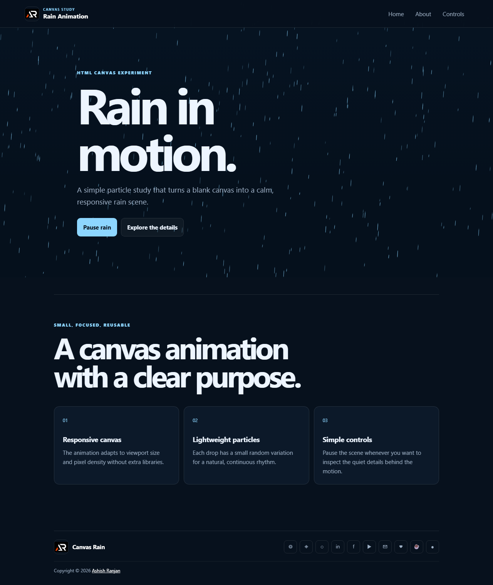

# Canvas Rain Animation



A lightweight, responsive rain particle animation built with the HTML canvas API, CSS, and plain JavaScript. The original canvas study remains the core experience, now presented in a small portfolio-ready page.

## Features

- Responsive canvas particle animation
- Pause and resume control
- Fixed branded header with a small-screen menu
- Short explanation of the canvas approach
- Icon-only developer and support links in the footer
- Floating scroll-to-top control

## Tech Stack

HTML, CSS, JavaScript, and the Canvas 2D API.

## Run locally

Open `index.html` in a browser or serve the folder with any static file server.

## Deployment

```bash
npm run build
npm run deploy
```

Live app: [https://a2rp.github.io/html-canvas-rain-animation/](https://a2rp.github.io/html-canvas-rain-animation/)

## Links

- Portfolio: [https://www.ashishranjan.net](https://www.ashishranjan.net)
- GitHub: [https://github.com/a2rp](https://github.com/a2rp)
- CodePen: [https://codepen.io/ash1198](https://codepen.io/ash1198)
- LinkedIn: [https://www.linkedin.com/in/aashishranjan](https://www.linkedin.com/in/aashishranjan)
- Facebook: [https://www.facebook.com/theash.ashish/](https://www.facebook.com/theash.ashish/)
- YouTube: [https://www.youtube.com/@ashishranjan-ashz?sub_confirmation=1](https://www.youtube.com/@ashishranjan-ashz?sub_confirmation=1)
- Email: [ash.ranjan09@gmail.com](mailto:ash.ranjan09@gmail.com)

## Support

- Support: [https://a2rp-donation-page.netlify.app/](https://a2rp-donation-page.netlify.app/)
- Buy Me A Coffee: [https://buymeacoffee.com/a2rp](https://buymeacoffee.com/a2rp)
- Patreon: [https://patreon.com/a2rp](https://patreon.com/a2rp)
